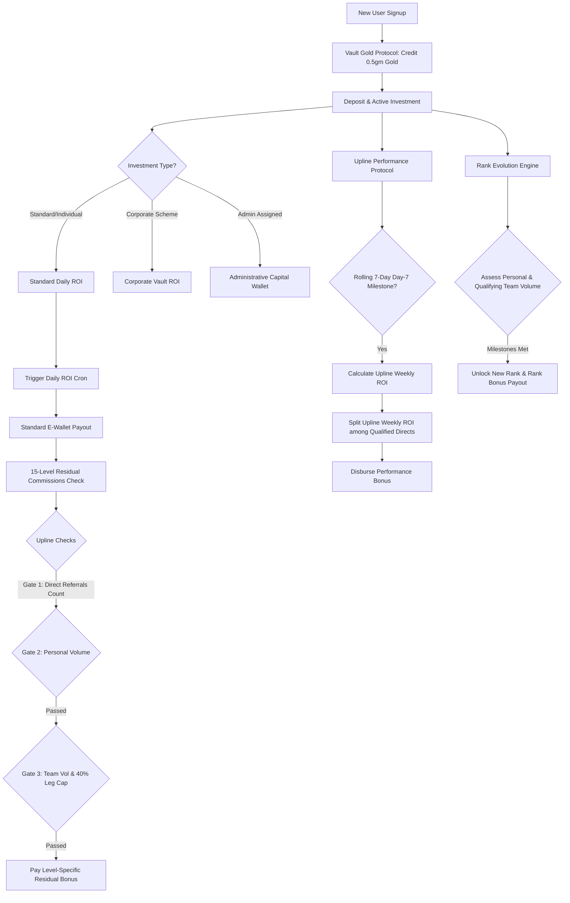

# Leverage Factory (levarage_factory)

Leverage Factory is a premium, digital-first social investment network and automated wealth-generation platform. It features multi-asset portfolio management, copy trading strategies, real-time market integrations, and a sophisticated multi-level marketing (MLM) commission and rank progression protocol.

---

## 🏗️ System Architecture & Workflow



---

## ⚡ Key Core Protocols

### 1. Daily ROI Distribution (`cron_daily_roi.php`)
Every active investment generates daily yield payouts based on the selected scheme terms:
- **Calculation**: Standard yield is calculated as `(amount * (total_return_percent / duration_days))`. Special schemes like the **Ripple Effect** delay payout until a specific window (e.g., day 35) is reached.
- **Double Payout Protection**: Staged ledger verification checks prevent double credits by checking existing records for target dates.
- **Completion Workflow**: Investments are automatically marked as `completed` and archived once their defined duration completes.

### 2. The 15-Level MLM Residual Commission Engine
Commissions cascade up the referrer tree to upline referrers up to 15 levels high. To prevent network imbalances and ensure organic growth, each level requires uplines to pass through **Three Security Gatekeepers**:

| Level | Direct Active Referrals | Min. Personal Investment ($) | Min. Team Volume ($) | Residual Share Rate |
| :---: | :---------------------: | :--------------------------: | :------------------: | :-----------------: |
| **L1**| 1                       | $50                          | $0                   | Configurable %      |
| **L2**| 2                       | $50                          | $0                   | Configurable %      |
| **L3**| 3                       | $100                         | $1,000               | Configurable %      |
| **L4**| 4                       | $250                         | $5,000               | Configurable %      |
| **L5**| 5                       | $500                         | $10,000              | Configurable %      |
| **L6**| 6                       | $1,000                       | $25,000              | Configurable %      |
| **L7**| 7                       | $2,500                       | $50,000              | Configurable %      |
| **L8**| 8                       | $2,500                       | $75,000              | Configurable %      |
| **L9**| 9                       | $5,000                       | $100,000             | Configurable %      |
| **L10**| 10                      | $5,000                       | $200,000             | Configurable %      |
| **L11**| 11                      | $10,000                      | $300,000             | Configurable %      |
| **L12**| 12                      | $25,000                      | $500,000             | Configurable %      |
| **L13**| 13                      | $50,000                      | $1,000,000           | Configurable %      |
| **L14**| 14                      | $50,000                      | $2,500,000           | Configurable %      |
| **L15**| 15                      | $100,000                     | $5,000,000           | Configurable %      |

#### ⚖️ The 40% Leg Balancing Rule
For team volume eligibility on Level 3 and above, the system enforces a strict leg volume cap. A single downline leg can only contribute up to **40% of the target requirements** for that level. Excess volume in any single leg is ignored for qualification purposes.

#### ♾️ Infinity Bonus
Nodes qualifying beyond Level 15 with **$100,000+ Personal Investment**, **50+ Direct Active Partners**, and **$10,000,000+ Total Downline Turnover** unlock the global Infinity Bonus commission rate.

### 3. Rolling Upline Performance Protocol (`cron_upline_performance.php`)
This rolling bonus rewards elite qualifiers with a direct share of their upline's earnings:
- **Qualifications**: Personal active investment $\ge \$10,000$ and at least 10 direct referrals who have active investments $\ge \$2,500$ each.
- **Payout Milestone**: Executes on a 7-day rolling cycle from the user's qualification date.
- **Yield Share**: Calculates 100% of the referrer's total ROI accrued in the last 7 days and divides it equally among all partners qualified under that specific upline on that day.

### 4. Rank Evolution & Milestones (`dashboard.php`)
The system analyzes network structure to automatically award rank achievements (e.g. Bronze, Silver, Gold, Platinum, VIP) based on two variables:
- **Personal Investment**: Minimum personal funds actively locked in schemes.
- **Qualifying Team Volume**: Total network turnover calculated under the 40% leg cap rule.
- **Rewards**: Instant rank advancement cash bonuses credited directly to standard E-wallets.

---

## 🖥️ User Dashboard Experience

The user portal (`dashboard.php`) integrates premium Tailwind UI styling with dynamic interactive capabilities:
- **Asset Portfolios**: Separate live wallet tracking for Standard E-Wallet, Corporate Wallet, Vault Gold, Vault Silver, and Visa Card assets.
- **Live Widgets**: Real-time commodities widgets (XAU/USD and XAG/USD) powered by TradingView embedded directly into the physical vault trackers.
- **Incentive Modals**: Automated vault signup promotions awarding users 0.5gm of pure physical gold as liquid capital.
- **Network Counters**: Precision countdown micro-timers monitoring scheduled protocol executions.

---

## 🛠️ Administrative & Management Controls

The administration panel (located inside the `admin/` folder) offers institutional control:
1. **User Supervision (`manage_users.php`, `view_user.php`)**: Complete account control, balance audits, lock statuses, and network genealogy path visualizations.
2. **Investment Scheme Setup (`schemes.php`)**: Administrative interfaces to customize duration days, total returns, and scheme designations (standard vs corporate).
3. **Identity Verification (KYC)**: Image-based submission approvals for legal compliance.
4. **Automated Logs & Audits**: Diagnostic trails tracking chronologies of daily ROI executions.

---

## ⚙️ Quick Start & Installation

### 💻 System Requirements
- PHP 7.4 or higher
- MySQL / MariaDB database server
- Cron support or task scheduler

### 🔌 Database Setup
1. Define database connection credentials in `includes/db_connect.php`:
   ```php
   $host = 'localhost';
   $db   = 'wirejybl_levarage';
   $user = 'wirejybl_levarage';
   $pass = 'your_secure_password';
   ```
2. Import the database schema containing the necessary structures for `users`, `investments`, `transactions`, `rank_bonuses`, and `system_settings`.

### ⏱️ Running Cron Engines
To simulate payouts or schedule automated daily executions, configure system cron-jobs:

- **Daily ROI and Residuals Payouts (At midnight)**:
  ```bash
  0 0 * * * php /path/to/cron_daily_roi.php > /dev/null 2>&1
  ```
- **Rolling Upline Performance Calculations (Daily)**:
  ```bash
  30 0 * * * php /path/to/cron_upline_performance.php > /dev/null 2>&1
  ```
- **Retroactive Yesterday Payout Simulators**:
  ```bash
  php /path/to/cron_yesterday.php
  ```
